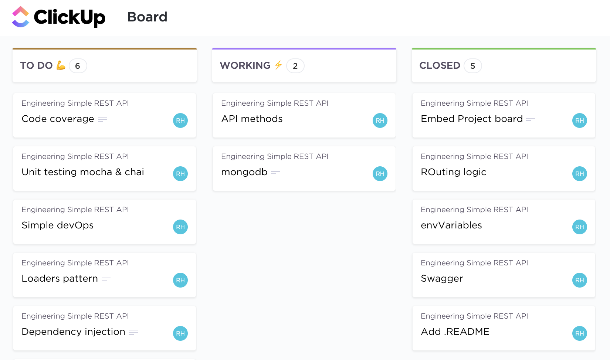

# First REST API

[](https://codecov.io/gh/ramonheras/first-RESTful-API)

### The aim 
This repository :octocat: contains a simple base project to get a taste of APIs design in Node.js. The focus is on putting together a Node.js project rather than on the language JS itself. In the bulleted list below, I've enumerated the key points observed under this project:

| Object                                            | Status   |
| --                                                | --       |
| 1. Language scope                                 | OK       |
| 2. Basic project/folder structure                 | OK       |
| 3. Testing frameworks                             | Ok       |
| 4. Documentation methodologies                    | OK       |
| 5. Automated Building                             | OK       | 
| 6. DevOps (automated testing and deployment)      | Almost   |

:beginner: The project is still under development. You can check out the project board [here](https://sharing.clickup.com/b/h/6-128548700-2/16ab57aa76c49cc) :sparkles:, visiting the API route `/project-board` or clicking on the image below.

[](https://sharing.clickup.com/b/h/6-128548700-2/16ab57aa76c49cc)

### The project

The project consists of a super simple backend for a to-do app. 

To read the complete API documentation, refer to the next section, "Running the project." 

### Running the project 

This project uses `swagger-autogen` to embed the API documentation in the project through the route `/doc`.

The steps to access the API documentation is as follows:

**1. Clone the repo into a new folder**

```bash
$ git clone https://github.com/ramonheras/first-RESTful-API.git
$ cd first-RESTful-API
```

**2. Make sure npm is installed**

Use yarn if you prefer it.

```bash
$ npm -v
```

**3. Execute `swagger-autogen` script**

**:warning: Warning:** *Make sure the port 7777 is available, or PORT value this env variable is defined in your machine*

The first command installs all dependencies. The second command runs the autogen script to generate the "swagger_output.json" file and start the app. Once this file is generated the app can be run as usual with the `npm start` command or your preferred script.

```bash
$ npm install
$ npm run swagger-autogen
```

**4. Open the API documentation**

Move to your preferred browser, and type the path `localhost:7777/doc`. The swagger documentation must show up.
:pencil: The port might be different in your machine if you already set the env variable `'PORT`. Also note that env.defaults does not override your local env vars.

----

**If something went wrong or you have any suggestions, open an issue and I'll try to get to it ASAP. :blush:**
